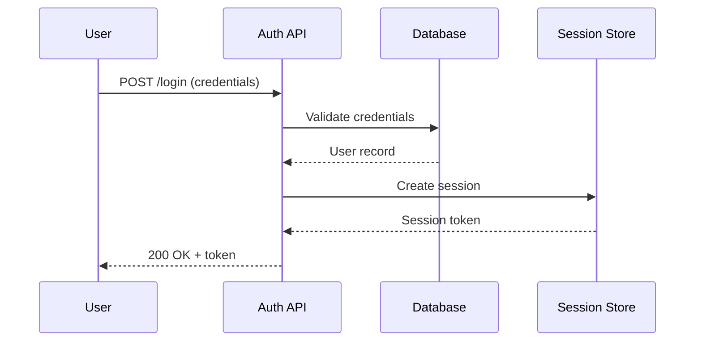

# Generate Architecture Diagram

You are generating an architecture diagram using Mermaid syntax.

## Instructions

1. Use `#tool:indexCodebase` to ensure code is indexed
2. Use `#tool:queryDocs` to find relevant code for: ${input:component:Which component or flow to diagram?}
3. Analyze the code structure, dependencies, and data flow
4. Generate a Mermaid diagram
5. Include a text description explaining the diagram
6. Optionally save to `docs/gallery/` using `#tool:writeDoc`

## Diagram Type Selection

Based on what you're documenting, choose the appropriate diagram type:

| Scenario | Diagram Type |
|----------|--------------|
| System components | `flowchart TD` |
| API request/response | `sequenceDiagram` |
| Object relationships | `classDiagram` |
| State transitions | `stateDiagram-v2` |
| Data pipeline | `flowchart LR` |

## Output Format

Always output in this format:

### [Component Name] Architecture

[2-3 sentence description of what this diagram shows]

```mermaid
[diagram code]
```

### Key Components

- **Component A**: Description
- **Component B**: Description

### Data Flow

1. Step 1 explanation
2. Step 2 explanation

## Example Output

### Authentication Flow Architecture

This diagram shows how user authentication flows through the system, from login request to session creation.



### Key Components

- **Auth API**: Handles authentication requests
- **Database**: Stores user credentials (hashed)
- **Session Store**: Redis-based session management
