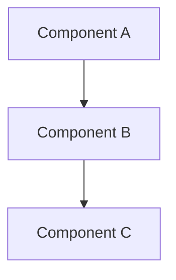

# Spec: [Title]

> **Status**: ACTIVE | IN_REVIEW | DONE  
> **Author**: [name]  
> **Created**: YYYY-MM-DD  
> **Updated**: YYYY-MM-DD  

---

## Summary

One-paragraph description of what this feature/change accomplishes.

---

## Motivation

Why is this needed? What problem does it solve?

---

## User Stories

- As a [role], I want [capability], so that [benefit].
- As a [role], I want [capability], so that [benefit].

---

## Design

### Overview

High-level design approach.

### Architecture Diagram



### Key Decisions

| Decision | Rationale | Alternatives Considered |
|----------|-----------|------------------------|
| Choice 1 | Why       | Options                |

---

## API / Interface

```typescript
// Define any new APIs, interfaces, or contracts
interface Example {
  method(): void;
}
```

---

## Implementation Plan

1. [ ] Step one
2. [ ] Step two
3. [ ] Step three

---

## Testing Strategy

- [ ] Unit tests for X
- [ ] Integration tests for Y
- [ ] Manual testing checklist

---

## Rollout Plan

How will this be deployed/released?

---

## Open Questions

- [ ] Question 1?
- [ ] Question 2?

---

## References

- Related ADR: [ADR-XXXX](../adr/XXXX-title.md)
- External docs: [link]()

---

<!-- 
LIFECYCLE:
1. Create in docs/specs/ACTIVE/
2. When implementation complete, move to docs/specs/DONE/
3. Use @doc-architect to move: "Move spec SPEC-NAME to done"
-->
